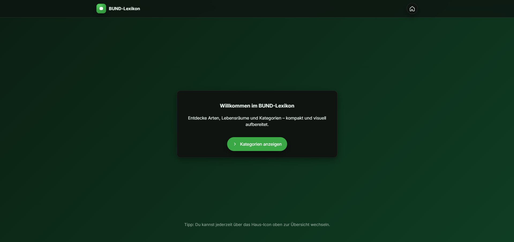
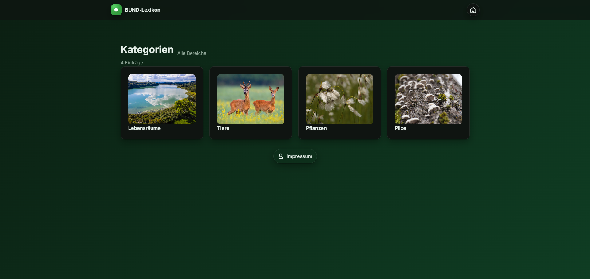
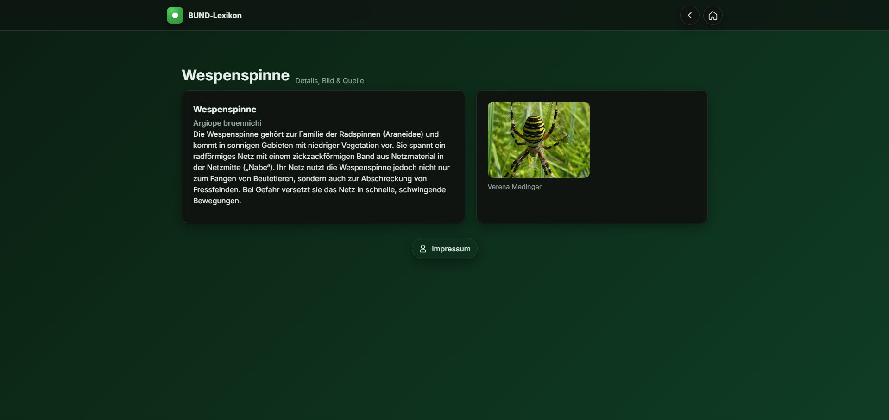

# BUND Lexicon

This project was developed as part of the **Bachelor studies at Hochschule Aalen**, supervised by **Prof. Dr. Carsten Lecon**. It provides an interactive, web-based lexicon to explore categories such as habitats, animals, plants, and fungi.

---

## Features

- Responsive web layout with modern CSS design tokens
- Category overview with grid-based navigation
- Detail pages for each entry (info pages with image, description, and source)
- Centralized Impressum (legal notice) button across pages
- Clean structure: HTML + CSS + JavaScript split

---

## Interface Preview

A quick look at the graphical user interface:

  
   
  <strong>Home Page (index.html)</strong>

  
   
  <strong>Categories Page (kategorien.html)</strong>

  
   
  <strong>Info Page (info-seite.html)</strong>

---

## Installation

1. Clone or download this repository.
2. Open the project folder in **Visual Studio Code**.
3. Install the **Live Server** extension if not already installed.
4. Right-click on `index.html` and select **"Open with Live Server"**.
5. The project will run in your default browser.

---

## Usage

- **Home (index.html)** → Intro page with a link to categories.  
- **Categories (kategorien.html)** → Browse habitats, animals, plants, fungi.  
- **Info page (info-seite.html)** → Shows details of a selected entry.  
- **Impressum (impressum.html)** → Legal notice, accessible via button.

---

## Important Note

The images and textual content used in this project originate from the [BUND Baden-Württemberg exhibition materials](https://www.bund-bawue.de/natur-landwirtschaft/naturoasen-schuetzen/landschaftspflege/mindelsee/mindelsee-ausstellung/). Their reuse or redistribution is **not permitted**. This project is for educational purposes only.

---

## License

No open-source license is granted for this project.  
All rights are reserved by the author.  
The included images and textual content originate from BUND Baden-Württemberg exhibition materials and may not be reused.
